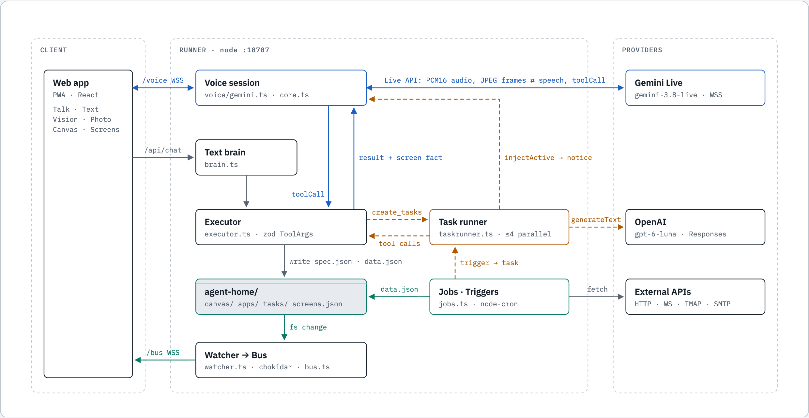
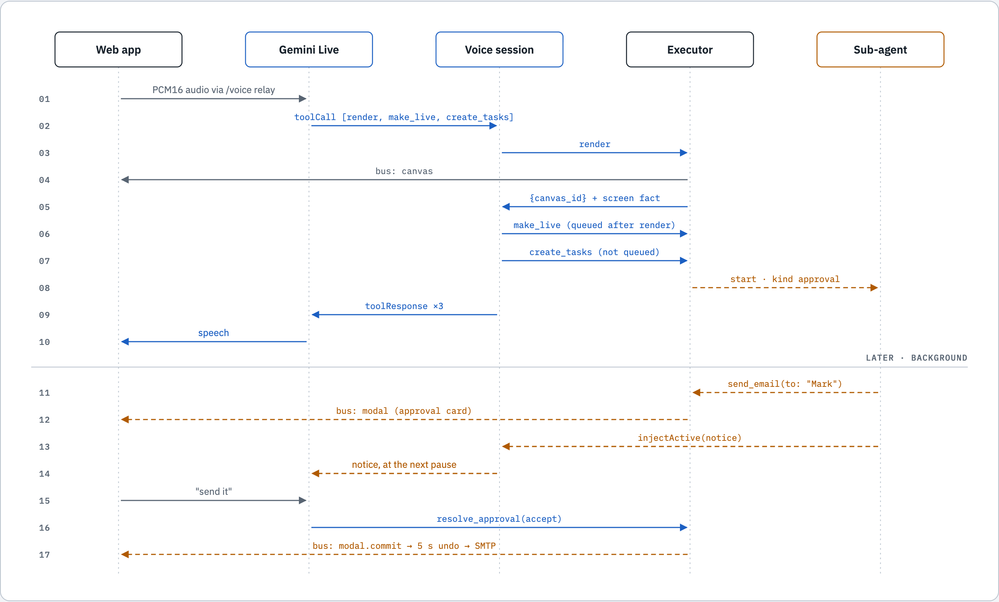
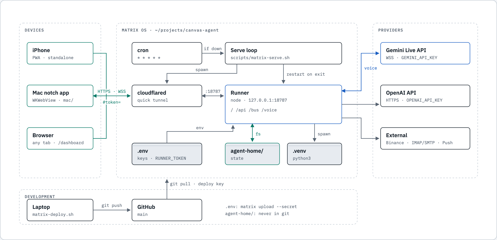
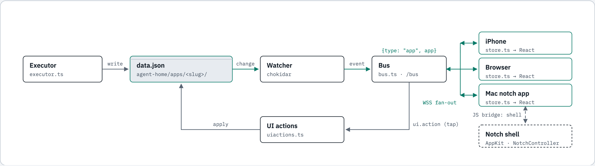

# Canvas Agent

Your personal living canvas in your pocket. Tell it to search, show you and create anything. Pin what it created and track everything important to you.

- Spec: [docs/SPEC.md](docs/SPEC.md) · Decisions: [docs/DECISIONS.md](docs/DECISIONS.md)
- Run locally: [deploy/local.md](deploy/local.md)
- Run on Matrix OS: [deploy/matrix.md](deploy/matrix.md) (setup, limits, troubleshooting)

## Architecture

**Runtime.** The voice session relays audio to Gemini Live, which holds the tools. Each tool call goes through the executor, which writes `agent-home/`, and the watcher pushes every change to the app over `/bus`. Slow work goes to sub-agents on OpenAI, which report back into the call.

<picture>
  <source media="(prefers-color-scheme: dark)" srcset="assets/diagrams/runtime-dark.png">
  
</picture>

**Request lifecycle.** One utterance with a screen change and a delegated email. Screen tools run in order, `create_tasks` runs at once, and the approval comes back later.

<picture>
  <source media="(prefers-color-scheme: dark)" srcset="assets/diagrams/lifecycle-dark.png">
  
</picture>

**Deployment.** Everything runs on Matrix OS. Devices reach it through a Cloudflare quick tunnel, and keys and state never leave it.

<picture>
  <source media="(prefers-color-scheme: dark)" srcset="assets/diagrams/deployment-dark.png">
  
</picture>

**State sync.** One file, one watcher, one bus: this is why the phone, the Mac and a browser always show the same thing.

<picture>
  <source media="(prefers-color-scheme: dark)" srcset="assets/diagrams/sync-dark.png">
  
</picture>

## Mac notch app

The same app on a MacBook, in a panel that hangs from the notch: hover to open, Talk, Text, Live vision, Photo, canvas, pinned screens, tasks. It talks to the same runner, so what you pin on the phone shows on the Mac. Build and pairing: [deploy/mac.md](deploy/mac.md).

```bash
bash scripts/mac-run.sh --matrix    # build with the Command Line Tools, launch paired to the Matrix instance
```

## Demo on Matrix OS

The demo instance runs on a Matrix OS cloud computer, in `~/projects/canvas-agent`, tracking `main`. The laptop is where code gets written. All commands below run on the laptop, from the repo root, with the Matrix CLI logged in (`matrix login`).

| Command | What it does |
|---|---|
| `bash scripts/matrix-pair.sh` | Shows the live URL, checks it answers, prints the pairing QR |
| `bash scripts/matrix-deploy.sh` | Pushes `main`, then on Matrix: pull, install, build, restart (the URL stays the same) |

### Set up the phone (once, and again whenever the URL changes)

1. Delete any old Canvas icon from the Home Screen.
2. Run `bash scripts/matrix-pair.sh` and scan the QR code with the phone camera. It opens in Safari.
3. In Safari, tap **Copy link** in the install hint, then Share → **Add to Home Screen**.
4. Open the new Home Screen app and tap **Paste**.

Step 4 is needed because iOS gives Home Screen apps their own storage: the token Safari saved never reaches the installed app.

### Before the demo

- Run `bash scripts/matrix-pair.sh`. If the URL is the same as before and it says "is up", you're set. If the URL changed (Matrix restarted the computer), set up the phone again.
- Open the app and do one short voice exchange, so the mic permission and connection are warmed up.
- Stop the laptop's `scripts/dev.sh`, so widgets don't run twice and you can't open the wrong instance.
- Don't deploy in the last hour before the demo.

### Good to know

- Bottom bar: **Text** · **Talk** · **Live vision** (video camera) · **Photo**. Talk's voice model is picked in the app's **Settings** (gear, top left): OpenAI or Gemini, from the next call. The choice is saved on the server (`agent-home/settings.json`) and wins over `ROUTE_voice` in `.env`. Live vision is a separate call that always uses Gemini Live with the camera streaming, so it can see what you point the phone at (`ROUTE_liveVision`). One call runs at a time: starting one ends the other, and closing the camera ends Live vision.
- Custom cards: when nothing in the component catalog fits (a ticking clock, a gauge, a small game), the agent hands it to a background task and a sub-agent writes a small self-contained web page for it (about 10-20 s). It runs sandboxed on the phone (no network, no access to the app or the token), follows light/dark, and can be pinned and made live like any widget: live data is pushed into it.
- Pictures: "draw me…" makes an image card with Nano Banana 2 Lite (`gemini-3.1-flash-lite-image`, `ROUTE_image`) in a few seconds. Change it by talking ("make it darker", "add a hat", "undo that"): the same card fades to the new picture. Pinned, it can also be redrawn on a schedule ("every morning a picture of today's weather").
- Conditions: any widget can watch a value ("when it starts raining…", "if BTC passes 90k…") and, when it becomes true, notify you and/or run a task that changes something (redraw a picture, update a card). The watched value refreshes by itself (a live source or a scheduled check). Custom cards can hold generated pictures too.
- New app versions reach the phone on their own. A changed URL does not: the Home Screen app is tied to its URL.
- The URL is a free Cloudflare quick tunnel. It survives deploys and changes only when the serve loop restarts (a Matrix reboot). For a URL that never changes, use a Cloudflare tunnel on your own domain (see [deploy/matrix.md](deploy/matrix.md#limits)).
- `.env` on Matrix is separate from the laptop's. After changing a key locally, upload it with `matrix upload .env projects/canvas-agent/.env --secret --force`, then run `bash scripts/matrix-deploy.sh`.

```
app/                PWA (Vite + React); app/src/lib/shell.ts is the Mac notch mode
mac/                Mac notch app: Swift shell around the PWA (deploy/mac.md)
runner/             Hono runner: tools, WS bus, file watcher, cron, sub-agents, voice sideband
packages/contract/  zod schemas: tool contract, canvas spec, file formats, bus events
config/routes.ts    provider routing table
python/             venv deps + helpers for generated fetch scripts
templates/agent-home/  seed for runtime data (agent-home/ is gitignored)
scripts/            bootstrap, dev, tunnel, check-footprint
assets/diagrams/    architecture diagrams used in this README (light and dark)
```
